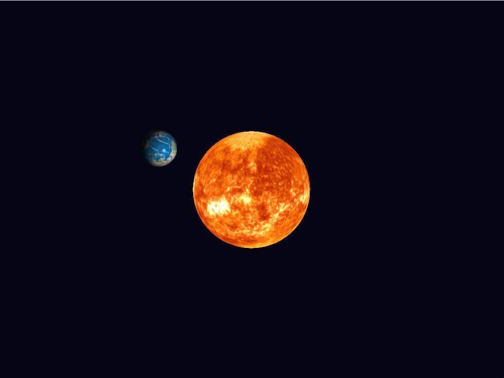

# Solar System – OpenGL Phong Shading

A real-time 3D solar system simulation built with OpenGL 3.3 Core Profile,
featuring two textured spheres with per-fragment Phong illumination. The Sun
sits at the world origin acting as a point light source, while the Earth orbits
around it with self-rotation, closely simulating real orbital mechanics.

---

## Demo



| Feature | Details |
|---------|---------|
| Rendering API | OpenGL 3.3 Core Profile |
| Shading Model | Per-fragment Phong (ambient + diffuse + specular) |
| Light Source | Point light at Sun center (world origin) |
| Animation | Earth orbital revolution + self-rotation |
| Textures | Real astronomical texture maps |
| Platform | Windows (Visual Studio 2022), CMake build system |

---

## Development Process

This project was built step by step following the OpenGL rendering pipeline:

### 1. Sphere Mesh Generation
Constructed a UV sphere programmatically using stacks and slices.
Each vertex stores position, normal, and texture coordinates packed
into a single interleaved VBO:

```cpp
// 8 floats per vertex: position(3) + normal(3) + uv(2)
float phi   = M_PI * i / stacks;
float theta = 2.f * M_PI * j / slices;
float x = sinf(phi) * cosf(theta);
float y = cosf(phi);
float z = sinf(phi) * sinf(theta);
```

### 2. MVP Transform Pipeline
Set up the full Model → World → View → Clip transform chain.
Each sphere gets its own model matrix; view and projection are shared:

```cpp
glm::mat4 proj  = glm::perspective(glm::radians(45.f), aspect, 0.1f, 100.f);
glm::mat4 view  = glm::lookAt(camPos, glm::vec3(0), glm::vec3(0,1,0));
glm::mat4 model = glm::translate(...) * glm::rotate(...) * glm::scale(...);
```

### 3. Vertex Shader
Passes world-space position and corrected normals to the fragment shader.
Used the normal matrix `transpose(inverse(model))` to handle non-uniform
scaling correctly:

```glsl
FragPos  = vec3(uModel * vec4(aPos, 1.0));
Normal   = mat3(transpose(inverse(uModel))) * aNormal;
gl_Position = uProj * uView * uModel * vec4(aPos, 1.0);
```

### 4. Fragment Shader — Phong Illumination
Implemented the full Phong reflection model per fragment. The Sun is
flagged as an emissive light source and bypasses lighting entirely:

```glsl
vec3 N = normalize(Normal);
vec3 L = normalize(uLightPos - FragPos);   // toward light
vec3 V = normalize(uViewPos  - FragPos);   // toward camera
vec3 R = reflect(-L, N);                   // reflection vector

vec3 ambient  = uAmbientStrength * texColor.rgb;
vec3 diffuse  = max(dot(N, L), 0.0) * texColor.rgb;
vec3 specular = uSpecularStrength * pow(max(dot(V,R), 0.0), uShininess) * vec3(1.0);

FragColor = vec4(ambient + diffuse + specular, 1.0);
```

### 5. Texture Loading
Used `stb_image` to load JPEG texture maps and uploaded them to the GPU
with mipmapping enabled for quality at varying distances:

```cpp
stbi_set_flip_vertically_on_load(true);
unsigned char* data = stbi_load(path, &w, &h, &ch, 0);
glTexImage2D(GL_TEXTURE_2D, 0, fmt, w, h, 0, fmt, GL_UNSIGNED_BYTE, data);
glGenerateMipmap(GL_TEXTURE_2D);
```

### 6. Orbital Animation
Earth position is computed each frame using parametric circular motion.
A separate self-rotation is applied on top via the model matrix:

```cpp
float orbitAngle = glfwGetTime() * 0.5f;   // orbit speed
float selfRot    = glfwGetTime() * 1.2f;   // self-rotation speed

glm::vec3 earthPos(
    orbitRadius * cosf(orbitAngle),
    0.f,
    orbitRadius * sinf(orbitAngle)
);
earthModel = glm::translate(I, earthPos) * glm::rotate(I, selfRot, up);
```

---

## Texture Maps

| Sphere | File | Source |
|--------|------|--------|
| Sun | `textures/sun.jpg` | [Solar System Scope – 2K Sun (Wikimedia Commons)](https://commons.wikimedia.org/wiki/File:Solarsystemscope_texture_2k_sun.jpg) |
| Earth | `textures/earth.jpg` | [Natural Earth III – shadedrelief.com](https://www.shadedrelief.com/natural3/pages/textures.html) |

---

## Dependencies

| Library | Version | Purpose |
|---------|---------|---------|
| OpenGL | 3.3 Core | Rendering API |
| GLFW | 3.x | Window, context, input |
| GLEW | 2.x | OpenGL extension loader |
| GLM | 0.9.9+ | Vector and matrix math |
| stb_image | 2.x | Single-header texture loader |

---

## Building on Windows (Visual Studio 2022)

### Step 1 — Install dependencies via vcpkg

```powershell
git clone https://github.com/microsoft/vcpkg C:\vcpkg
C:\vcpkg\bootstrap-vcpkg.bat
C:\vcpkg\vcpkg install glfw3:x64-windows glew:x64-windows glm:x64-windows
```

### Step 2 — Download stb_image.h

```powershell
Invoke-WebRequest `
  -Uri "https://raw.githubusercontent.com/nothings/stb/master/stb_image.h" `
  -OutFile "stb_image.h"
```

Place `stb_image.h` in the same directory as `main.cpp`.

### Step 3 — Configure CMake

```powershell
mkdir build && cd build
cmake .. -DCMAKE_TOOLCHAIN_FILE=C:\vcpkg\scripts\buildsystems\vcpkg.cmake -A x64
```

> **Tip:** If you see a platform mismatch error, delete everything in the
> `build/` folder (`Remove-Item -Recurse -Force *`) and re-run cmake.

### Step 4 — Compile

```powershell
cmake --build . --config Release
```

Output: `build\Release\solar_system.exe`
Shaders and textures are copied automatically by the CMake post-build step.

---

## Running

```powershell
cd build\Release
.\solar_system.exe
```

| Key | Action |
|-----|--------|
| ESC | Quit |

---

## Project Structure

```
solar_system_project/
├── main.cpp            ← Sphere mesh, VAO/VBO setup, render loop
├── vertex.glsl         ← Vertex shader: MVP transform, normal matrix
├── fragment.glsl       ← Fragment shader: Phong lighting model
├── stb_image.h         ← Texture loader (download separately)
├── CMakeLists.txt      ← CMake build config with vcpkg support
├── README.md           ← This file
└── textures/
    ├── sun.jpg         ← Solar System Scope (Wikimedia Commons)
    └── earth.jpg       ← Natural Earth III (shadedrelief.com)
```

---

## Troubleshooting

| Problem | Fix |
|---------|-----|
| Black screen | Check that `textures/`, `vertex.glsl`, `fragment.glsl` are in the same folder as the `.exe` |
| `M_PI` undeclared | Add `#define _USE_MATH_DEFINES` before any `#include` on MSVC |
| `glfw3` not found | Re-run cmake with `-DCMAKE_TOOLCHAIN_FILE=C:\vcpkg\...` |
| Platform mismatch | Clear the build folder and re-run cmake |

---

## References

| # | Reference |
|---|-----------|
| [1] | J. de Vries, *LearnOpenGL – Basic Lighting*, https://learnopengl.com/Lighting/Basic-Lighting |
| [2] | J. de Vries, *LearnOpenGL – Textures*, https://learnopengl.com/Getting-started/Textures |
| [3] | Khronos Group, *OpenGL 4.6 Reference*, https://registry.khronos.org/OpenGL-Refpages/gl4/ |
| [4] | G. Truc, *OpenGL Mathematics (GLM)*, https://github.com/g-truc/glm |
| [5] | S. Barrett, *stb_image.h*, https://github.com/nothings/stb |
| [6] | Solar System Scope, *2K Sun Texture*, Wikimedia Commons |
| [7] | T. Patterson, *Natural Earth III*, https://www.shadedrelief.com/natural3/pages/textures.html |
| [8] | Claude (Anthropic), *AI coding assistant used during development*, https://claude.ai |

---

## AI Assistance

**Tool used:** Claude (Anthropic) — https://claude.ai

Claude was used as a coding assistant during the development of this project.
The following prompts were submitted:

1. *"What is the correct way to pass a normal matrix to a GLSL shader to handle non-uniform scaling?"*
2. *"How do I set up a CMakeLists.txt for an OpenGL project with GLFW, GLEW, and GLM on Windows?"*
3. *"My CMake cannot find glfw3 on Windows — what is the recommended fix?"*
4. *"Why is M_PI undeclared in MSVC and how do I fix it?"*
5. *"How do I load a JPEG texture in OpenGL using stb_image?"*
6. *"What are good free texture maps for a sun and earth?"*